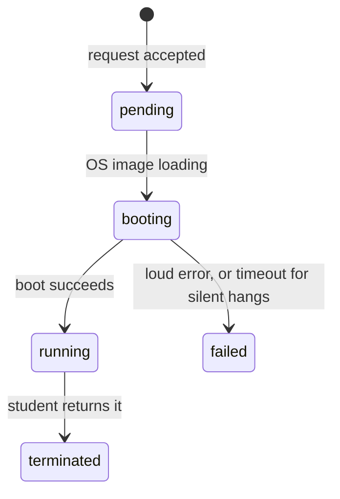

# Genie

An on-demand VM provisioner for students. A small control plane, built from first principles in Go.

**Status:** Phase 1, in active development. Core control plane, in-memory, simulated VMs.

## What it does

Students request VMs through an HTTP API. Genie enforces per-student quotas, drives each VM through a real lifecycle, and is designed to provision actual cloud machines behind a swappable backend. The VMs are simulated for now, deliberately: the hard part of a provisioner is the brain (state, ownership, limits, failure handling), not the cloud SDK call, so the brain gets built and tested first against imaginary machines. Swapping in a real provisioner later is one implementation behind an interface.

## What Genie is (and isn't)

Genie is a **control plane**: the part of a system that decides what should exist, who is allowed to have it, and what state everything is in. It contains no hypervisor. The layer that actually executes virtual machines by carving up real CPU and memory and booting a guest OS (KVM, QEMU, AWS Nitro) is the **data plane**, and it is deliberately out of scope. Genie's VMs are records driven through a real lifecycle, not workloads on real hardware.

That boundary is the same one production clouds draw. When you call EC2's `RunInstances`, you are talking to AWS's control plane; a hypervisor on some host is the data plane that breathes life into the instance. In Phase 5, Genie's control plane will call a real cloud's control plane: a brain delegating to a bigger brain, neither touching the metal.

What this codebase teaches, it teaches by embodiment rather than description: what a control plane actually is, lifecycle state machines (and why `failed` isn't `terminated`), check-then-act races and the lock that closes them, quota versus rate limiting as different defenses for different threats, and layering as concurrency safety.

## Architecture

Each layer has one job and talks only to the layer below it:

| File | Role |
|---|---|
| `handlers.go` | HTTP layer (Gin). Translates requests and responses. Holds no logic. |
| `manager.go` | The brain. Quota enforcement, VM creation, lifecycle driving. |
| `store.go` | Guarded in-memory state. The only code that touches the map. |
| `vm.go` | The VM itself: lifecycle states and transition rules. |

## VM lifecycle



`failed` and `terminated` are deliberately distinct: an operator has to tell a fire ("the system couldn't deliver") apart from a normal return.

## Design decisions

- **On-demand, not pooled.** VMs are created from nothing and destroyed for real. `terminated` is a grave, not a shelf.
- **Quota counts alive VMs** (`pending` + `booting` + `running`), not just running ones. Otherwise a burst of requests sails past the cap before anything finishes booting.
- **Check-then-act is atomic.** The quota check and VM creation happen under a manager-level lock. Without it, two concurrent requests both pass the check and the quota silently breaks.
- **Failed boots don't consume quota.** Charging a student for the system's failure is bad UX. The abuse this opens is handled by rate limiting, not by the quota.
- **Three limits, three threats** (roadmap): per-student quota caps what you hold, a per-student rate limit stops failure-spam and runaway cost, and a global rate limit protects the server itself.
## Roadmap

- [x] Phase 0: server skeleton, boot sequence
- [ ] Phase 1: VM store, create / list / terminate, quota enforcement
- [ ] Phase 2: real lifecycle with async boot, failure paths, boot timeout
- [ ] Phase 3: per-student and global rate limiting
- [ ] Phase 4: provisioner interface (fake implementation)
- [ ] Phase 5: real cloud provisioner behind the same interface
## Running

```bash
go run .
```

The server boots on `localhost:8080`, with a proper boot sequence, because a control plane should boot like the machines it manages.
 